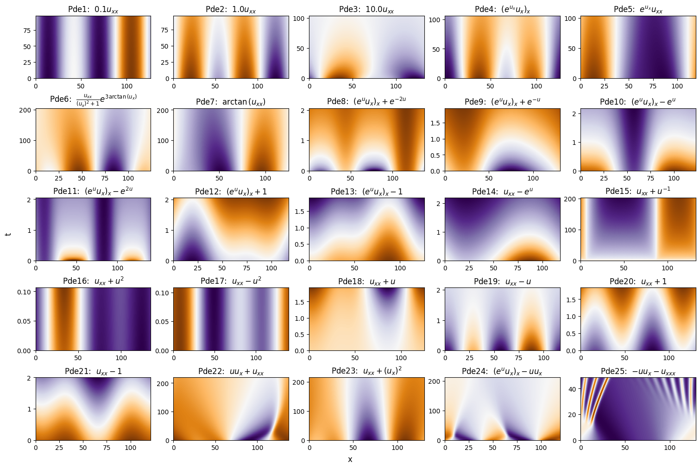

# SymPDE Suite

This repository provides the dataset _SymPDE Suite_. The dataset can function as a benchmark to evaluate (equivariant) neural PDE solvers and to understand how symmetries are learned in neural PDE solvers. The dataset consists of 25 PDEs containing a wide variety of symmetries. 



## Repository

- `sympdesuite/` Code to generate and visualize the PDEs from the SymPDE Suite dataset.
- `generate_data.py` Script to generate the PDEs, saving them in `data/`. See below for more instructions.
- `demo.ipynb` Notebook showcasing the generated by `generate_data.py`

## Installation

```bash
conda create -n sympdesuite python=3.10
conda activate sympdesuite
pip install -r requirements.txt
```

## Usage

```bash
python generate_data.py # Generates samples and saves them in data/

python generate_data.py --help

# usage: generate_data.py [-h] [--data_dir DATA_DIR] [--Lmax LMAX] [--Tmax TMAX] [--Nx NX] [--Nt NT] [--tol TOL] [--pde_names PDE_NAMES [PDE_NAMES ...]] [--n_splits N_SPLITS [N_SPLITS ...]]

# Generating PDE data

# options:
#   -h, --help            show this help message and exit
#   --data_dir DATA_DIR   Path to data directory
#   --Lmax LMAX           Length of spatial domain
#   --Tmax TMAX           Length of temporal domain. If none is specified (default), then value from PDE class is used
#   --Nx NX               Number of spatial grid points
#   --Nt NT               Number of temporal grid points
#   --tol TOL             Tolerance for ODE solver
#   --pde_names PDE_NAMES [PDE_NAMES ...]
#                         List of name of the PDEs to generate data for
#   --n_splits N_SPLITS [N_SPLITS ...]
#                         Train, val, test split
```

The samples produced by `generate_data.py` can be inspected in `demo.ipynb`